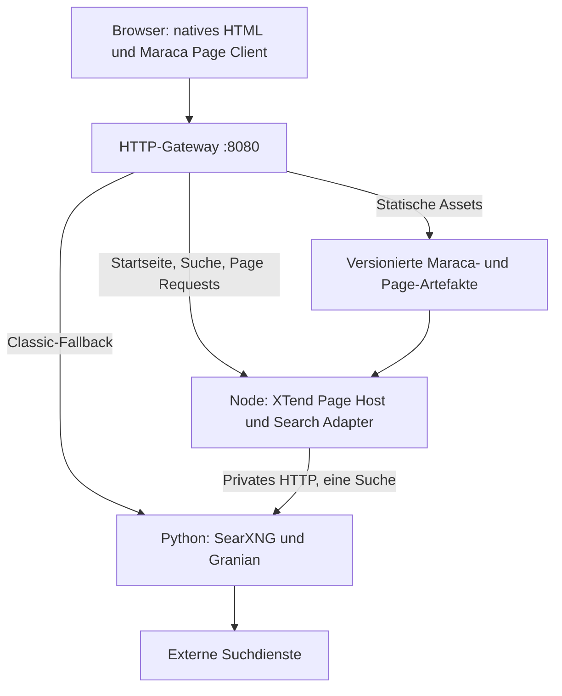

# ADR-001: SearXNG mit XTend 0.8.0, Maraca und resumierbarer Search-SPA

| Feld | Festlegung |
| --- | --- |
| Status | **Vorgeschlagen; zur Implementierung vorbereitet.** Die Architektur wird nach den Machbarkeitsprüfungen G0–G2 bestätigt oder mit begründeter Änderung fortgeschrieben. |
| Datum | 19. September 2026 |
| Projekt | SearXNG-XTend Search; Arbeitsname, keine Google-Zugehörigkeit |
| Entscheidung | SearXNG-Python-Core erhalten; Node-Seitenhost als dünne XTend-Integration; RMT als UI-Quelle; Maraca-Bundle; Initial-SSR mit signiertem Resume; clientseitige Seitennavigation |
| Zielversion | XTend/RMT/Maraca **0.8.0**, einschließlich Bewertung des Hydrangea-Toolings |
| Prüfgegenstand | Funktionsfähige Suchanwendung **und separat** Qualität, Autonomie und Korrektheit der XTend-MCP-Nutzung durch Codex/ChatGPT Work |
| Auslieferung | Ein selbstständig betreibbares Anwendungsimage für Docker auf Ubuntu und Linux-Servern; ergänzende Compose-Profile |
| Adressaten | Implementierendes Modell, menschlicher Reviewer, Betreiber, XTend-Maintainer |

**Verbindlichkeit:** MUSS bezeichnet ein Abnahmekriterium, SOLL die begründbar abweichbare Vorgabe, KANN eine optionale Erweiterung. Codeblöcke mit Projektverträgen sind zu implementierende Schnittstellen, keine Behauptung über bereits existierende XTend-APIs. Konkrete Framework-Aufrufe müssen gegen den bei Projektstart eingefrorenen lokalen Stand geprüft werden.

Dieses Dokument ist der Implementierungsauftrag. Es behauptet weder eine bereits gebaute App noch bestandene Browser-, Docker-, Performance- oder MCP-Prüfungen. Die bisherige Arbeit umfasst Quellenanalyse und Architekturentwurf.

## 1. Kontext und Problem

SearXNG aggregiert Suchergebnisse in Python und bietet im Standardfrontend serverseitig gerenderte Jinja-Templates. Ein Dokumentwechsel ist ein robuster Ausgangspunkt, setzt jedoch die sichtbare Seite bei aufeinanderfolgenden Suchen, Filterwechseln und Pagination neu zusammen. Gewünscht ist eine ruhige, Google-artige Suchoberfläche mit dauerhaftem Suchfeld, klaren Filtern und austauschbarer Ergebnisfläche. „Google-artig“ bezeichnet das vertraute Interaktionsmuster, nicht Markenübernahme, Tracking oder pixelgenaues Kopieren.

Das Projekt prüft, ob XTend einen konkreten Nutzervorteil liefert: benutzbares HTML beim ersten Aufruf, anschließend Navigation ohne Full-Document-Reload, konsistente History, erhaltene Eingaben und schnelle Reaktion der Shell während einer Suche. Schnellere Antworten externer Suchmaschinen sind davon nicht zu erwarten. Mehrschichtige Architektur und zusätzliche Runtime-Kosten müssen durch Messungen sichtbar bleiben.

Gleichzeitig ist dies eine Leistungsprüfung des XTend MCP: Kann das Modell passende Dokumentation finden, RMT korrekt erstellen, Diagnosen verwerten, Maraca sinnvoll konfigurieren, echte Resumability nachweisen und Grenzen ohne erfundene APIs erkennen?

## 2. Quellenstand und nachgewiesene Ausgangslage

### 2.1 SearXNG

Für dieses ADR wurde das aktuelle Repository von [searxng/searxng](https://github.com/searxng/searxng) am 19.09.2026 separat zur Analyse bezogen. Beobachteter Commit:

```text
e831fc2a1cad50c9979b5f6f680376410218188c
```

Zu Beginn der Implementierung MUSS Codex erneut den dann aktuellen Upstream beziehen, seinen Commit festhalten und Abweichungen zu dieser Analyse prüfen. Danach bleiben Baseline und Implementierung auf genau diesem Commit fixiert; während der Messreihe erfolgt kein stilles Update.

Belegte Befunde:

- `/search` unterstützt HTML und konfigurierbare Datenformate. JSON muss in `search.formats` freigeschaltet sein; ein nicht freigeschaltetes Format führt zu HTTP 403. Die API bietet Suchparameter wie Sprache, Kategorie, Seite, Zeitraum und SafeSearch. [Search API](https://docs.searxng.org/dev/search_api.html)
- Im untersuchten Python-Pfad ruft `search()` zunächst `SearchWithPlugins.search()` auf und serialisiert danach die Antwort. Engine-Threads werden bis zur Deadline eingesammelt; Plugin-Nachverarbeitung und Abschluss des Resultcontainers liegen vor der Rückgabe. Daraus folgt **kein verfügbarer Browser-Ergebnisstream**. [Webroute](https://github.com/searxng/searxng/blob/e831fc2a1cad50c9979b5f6f680376410218188c/searx/webapp.py), [Search-Core](https://github.com/searxng/searxng/blob/e831fc2a1cad50c9979b5f6f680376410218188c/searx/search/__init__.py)
- Die aktuelle JSON-Antwort enthält `query`, `results`, `answers`, `corrections`, `infoboxes`, `suggestions` und `unresponsive_engines`. **`paging` und ein verlässlicher Gesamtzähler fehlen.** Ältere Beispiele dürfen nicht als Vertrag übernommen werden. [JSON-Serializer](https://github.com/searxng/searxng/blob/e831fc2a1cad50c9979b5f6f680376410218188c/searx/webutils.py)
- Der Quellcode akzeptiert beim Zeitraum auch `week`; die kurze API-Seite nennt derzeit nur day/month/year. Maßgeblich sind der eingefrorene Parser und die Fähigkeiten der aktivierten Engines. [Parameteradapter](https://github.com/searxng/searxng/blob/e831fc2a1cad50c9979b5f6f680376410218188c/searx/webadapter.py)
- Der aktuelle Containerpfad verwendet Granian/WSGI und liegt unter `container/`, unter anderem in `builder.dockerfile`, `dist.dockerfile` und `entrypoint.sh`. Kein veraltetes Root-`Dockerfile` oder uWSGI-Setup voraussetzen. [Containerquellen](https://github.com/searxng/searxng/tree/e831fc2a1cad50c9979b5f6f680376410218188c/container)

Die öffentliche Containerdokumentation beschreibt Compose, Konfiguration unter `/etc/searxng` und Daten unter `/var/cache/searxng`. Diese Pfade sind Ausgangspunkte für das eigene Image, dessen tatsächliches Verhalten separat getestet wird. [Installation container](https://docs.searxng.org/admin/installation-docker.html)

### 2.2 Lokale XTend-Umgebung

Bei der ADR-Erstellung wurde folgende vorhandene Umgebung gelesen:

```text
XTEND_ROOT=/home/konni/Downloads/xtend-main/xtend
Git HEAD=d9d54cee532bcfd78f84e8c34471da9d05d9c431
@ccslabs/xtend=0.8.0
@ccslabs/xtend-rmt=0.8.0
@ccslabs/xtend-maraca=0.8.0
@ccslabs/xtend-mcp=0.1.0
```

**Wichtige Unterscheidung:** „MCP-Leistungsprüfung unter XTend 0.8.0“ bedeutet hier nicht, dass das MCP-Paket selbst Version 0.8.0 trägt. Sein beobachteter Paketstand ist 0.1.0. Beide Versionen werden separat protokolliert.

Der XTend-Checkout enthält lokale Änderungen, auch an MCP-Quellen und generiertem Wissen. Der Git-Commit allein identifiziert die benutzte Toolchain deshalb nicht. Codex MUSS den tatsächlich verwendeten Arbeitsstand einschließlich relevanter Änderungen durch Dateihashes bzw. ein geprüftes Quellpaket erfassen. Den Checkout nicht zurücksetzen, bereinigen oder unbemerkt aktualisieren. Für verändernde Vorbereitung einen isolierten Snapshot verwenden, der diese Änderungen einschließt.

Die Pakete verlangen Node ≥24; der gelesene Workspace deklariert zusätzlich `^24.18.0 || ^26.5.0` und npm `11.17.0` als Entwicklungsumgebung. Beim Start erneut aus den Paketdateien lesen und genau eine kompatible Toolchain pinnen.

### 2.3 Verfügbare XTend-Verträge

Folgende lokale Quellen wurden für dieses ADR gelesen; Pfade relativ zu `XTEND_ROOT`:

| Quelle | Für dieses Projekt relevanter Befund |
| --- | --- |
| `docs/de/ssr-pages.md` | Node-Seitenhost, Page Client, History/Scroll, native GET-Formulare, Maraca-Anbindung, signiertes Initial-Resume und optionaler Page Wire |
| `docs/de/hydration-policies.md` | Rendering, Hydration und Resume sind unterschiedliche Vorgänge; Resume verlangt Snapshot, Integrität und Event-Replay-Vertrag |
| `docs/de/xtend-maraca.md` | RMT → Plan → Production-Bundle; Auswahl benötigter Komponenten; Bundle- und Größenreports |
| `docs/de/rmt-node-ssr-adapter.md` | Node-SSR-Adapter, Light DOM, Envelope und CSP |
| `docs/de/maraca-fastpass-abort-boundary.md` | Eine Scheduler-Autorität; FastPass für Shell-Intents; Guards gegen veraltete sichtbare Commits |
| `docs/de/rmt-jit-hydrangea.md` | Hydrangea ist Compiler-/Preview-/Plan-Tooling; kein Browser-Renderer und keine Voraussetzung für ausgelieferte Maraca-Bundles |
| `docs/de/xtend-mcp.md` und `products/xtend-mcp/README.md` | Retrieval mit Provenienz; Diagnostics, Compile Check, Repair Plan und Maraca Plan; standardmäßig kein Workspace-Write |
| `xtendrmt/node-page-host.d.ts`, `xtend-maraca/page-bootstrap.mjs`, `tests/ssr-pages/node_browser_suite.js` | Konkrete Host-, Bootstrap- und Signaturintegration als Einstieg für den Spike |

Im Werkzeugkatalog dieser ADR-Sitzung war kein direkt aufrufbares XTend-MCP-Tool verfügbar. Es wurden **keine MCP-Erfolge simuliert** und keine MCP-Benchmarkwerte erhoben. Die spätere Leistungsprüfung muss mit einer tatsächlich verbundenen, identifizierten lokalen MCP-Instanz erfolgen. Direkte Dateilektüre in dieser Voranalyse ist keine MCP-Evidence.

## 3. Ziele und Nicht-Ziele

### Ziele des MVP

1. Startseite und Suchergebnisse kommen als lesbares, bedienbares SSR-HTML an.
2. Das Initial-Resume übernimmt vorhandene Surfaces und serialisierten Zustand; ein gültiger Seed führt nicht zu einem vollständigen Neuaufbau oder einer zweiten Initialsuche.
3. Suche, unterstützte Filter und Pagination navigieren nach erfolgreicher Aktivierung clientseitig. Ein URL-Direktaufruf liefert denselben fachlichen Zustand.
4. Back/Forward, Reload, Scroll, Fokus und schnelle aufeinanderfolgende Suchen funktionieren deterministisch.
5. SearXNG bleibt für Suche, Engine-Aufrufe, Ranking, Deduplizierung, Plugins und Suchsyntax zuständig.
6. RMT und Maraca besitzen die dynamische UI. Host-Code bleibt auf Transport, Normalisierung und Browser-/Serverintegration begrenzt.
7. Das gleiche Anwendungsimage ist auf dem lokalen Ubuntu-Rechner und einem Linux-Server ohne XTend-Checkout zur Laufzeit startbar.
8. Funktions-, Performance- und Tooling-Ergebnisse sind anhand versionierter Nachweise überprüfbar.

### Nicht-Ziele

- Kein Ersatz des Search-Core, kein eigener Suchindex und kein selbst implementiertes Ranking.
- Keine React-/Vue-Schicht, kein zweiter Clientrouter und kein paralleler State-/DOM-Renderer.
- Keine Vollparität aller SearXNG-Ergebnistypen, Einstellungen und Plugins im ersten UI-Release.
- Keine automatische Suche bei jedem Tastendruck, kein Such-Prefetch und keine Drittanbieter-Autocomplete-Abfragen im MVP.
- Keine Konten, Synchronisierung von Suchhistorien, Analytics, Werbung, KI-Zusammenfassungen oder personalisierte Ergebnisprofile.
- Kein Service Worker/PWA-Offlinecache für Suchergebnisse.
- Kein Streaming nur zum Demonstrieren einer Animation; kein PHP-/Laravel-Host zusätzlich zum gewählten Node-Host.
- Keine Veröffentlichung eines Upstream-PRs oder öffentliche Bereitstellung als Bestandteil dieses ADR-Auftrags.

## 4. Architekturentscheidung

### D1 – Dünne Integration statt tiefem Fork

Das Projekt führt einen eigenen Integrationsstand auf einem gepinnten SearXNG-Checkout. Engine-Implementierungen und Suchalgorithmus bleiben unverändert. Neue Dateien, ein schmaler interner Metadatenadapter sowie notwendige Web-/Containeranschlüsse sind die erwartete Änderungsfläche.

Standard-HTML über das Upstream-Theme `simple` bleibt verfügbar. Jede Änderung an bestehenden SearXNG-Dateien wird in `docs/upstream-delta.md` mit Zweck, Alternativen und Merge-Risiko dokumentiert.

### D2 – Node-SSR-Host vor Python

Der vorhandene XTend-Node-Seitenhost übernimmt die neue Oberfläche. Er lädt Suchdaten über den privaten HTTP-Pfad des Python-Prozesses und erzeugt daraus SSR, Page Responses und Resume-Daten. Die vorhandene `createNodePageHost`-/Maraca-Page-Integration wird vor einer eigenen Transport- oder History-Implementierung verwendet.

Begründung: Ein dokumentierter Node-Host ist vorhanden; ein gleichwertiger Python-SSR-/Resume-Adapter wurde nicht nachgewiesen. Ein eigener Python-Port des RMT-Renderers würde den Test unnötig ausweiten. Node ist in dieser Entscheidung auch Laufzeitbestandteil, nicht nur Buildwerkzeug.

### D3 – Eine UI- und Navigationsautorität

Der XTend Page Client besitzt Navigation, URL/History und Seitentransport. Maraca/RMT besitzt Surfaces, Zustandsübergänge und DOM-Commits. Je Root existiert genau ein Controller. Kein zusätzliches `popstate`-/Fetch-/DOM-System außerhalb dokumentierter Integrationsports.

### D4 – Ein Anwendungscontainer mit kontrollierten Prozessen

Ein minimales HTTP-Gateway stellt genau einen öffentlichen Port bereit und routet zu Node oder Python. Ein kleiner Supervisor/PID-1 verwaltet Gateway, Node und Python/Granian. Diese bewusst gewählte Mehrprozess-Ausnahme erlaubt einen klassischen Suchpfad, auch wenn der Node-Host ausfällt. Der Betrieb wird in Abschnitt 10 konkretisiert.

### D5 – Kein Ergebnisstream im Standard-MVP

Der untersuchte Suchpfad liefert ein abgeschlossenes Resultset. Das MVP verwendet deshalb eine Antwort pro Suche. Streaming wird nur nach einer positiven erneuten Backendprüfung umgesetzt; andernfalls entsteht ein begründetes Follow-up gemäß Abschnitt 11.

### Verworfene Alternativen

| Alternative | Entscheidung und Trade-off |
| --- | --- |
| Nur Jinja kosmetisch ändern | Einfacher Betrieb, erfüllt jedoch die Prüfung des echten XTend-SSR-/Resume-Lifecycles nicht |
| Statische HTML-Shell plus JSON-Fetch | Einfacher Start, aber initial fehlende Ergebnisse und schwächerer no-JS-Pfad |
| Jinja-HTML mit selbst erfundenen Resume Seeds | Kein belegter Integritäts-/DOM-Vertrag; hohes Risiko, bloße Hydration als Resume auszugeben |
| Python-Implementierung des portablen XTend-Renderers | Zusätzliche Framework-Portierung; erst separates Folgeprojekt |
| React/Vue als äußere SPA | Zusätzlicher Runtime-, Zustands- und Ownership-Layer ohne Bedarf |
| Drei verpflichtende App-Container | Gute Prozesstrennung, verfehlt aber das gewünschte eigenständig startbare App-Image; spätere optionale Betriebsform |

## 5. Zielarchitektur und Komponenten



Gateway, Node, Python und ausgelieferte Artefakte befinden sich im selben App-Image. Ein externer TLS-Proxy sowie optional Valkey gehören zur Betriebsumgebung. Keine Browseranfrage darf den privaten Core direkt adressieren.

| Komponente | Verantwortung | Abgrenzung |
| --- | --- | --- |
| SearchShell | Persistentes Suchfeld, Navigation, Filtertrigger, Statusregion | Enthält keine eigene Engine-Logik |
| SearchForm | Native GET-Semantik, Draft-Eingabe, Submit | Vor Aktivierung sofort nutzbar |
| FilterSurface | Kategorie, Sprache, Zeitraum, SafeSearch | Zeigt nur erlaubte Werte; keine Garantie jeder Engine-Fähigkeit |
| ResultSurface | Ergebnisliste, Leerzustand, Teilfehler, Pagination | Stabile Item-Identitäten; externe Links bleiben native Links |
| Page Host | Routing, Requestkontext, SSR, Page Response, Head, Resume-Signer | Kein öffentliches Compiler-/MCP-Endpoint |
| Search Adapter | Validierung, Core-Aufruf, DTO, Timeout, Fehler- und Redirectübersetzung | Kein zusätzliches Ranking |
| Python-Metadatenadapter | Ergänzt fehlende normalisierte Such-/Paging-Metadaten | Benutzt denselben SearchWithPlugins-Pfad |
| Gateway | Routing, Body-/Headerlimits, Assets, Classic-Zugriff | Keine Suchdaten-Caches |
| Evidence Harness | Tests, Traces, Messungen, MCP-Protokollierung | Im Produktionsbetrieb deaktiviert bzw. nicht ausgeliefert |

**MVP-UI:** Allgemeine Websuche ist Pflicht. Ein zweiter konfigurierter Kategoriepfad, vorzugsweise Bilder mit einfacher Kartenansicht, prüft den Surface-Wechsel. Die Auswahl wird in G1 an den verfügbaren Engines festgemacht. Eine Bild-Lightbox, Video-/Karten-Spezialrenderer und alle erweiterten Ergebnistypen sind Follow-ups. Nicht unterstützte Spezialansichten verweisen unter Erhalt des Suchzustands auf Classic.

## 6. Integrationsstrategie SearXNG ↔ XTend

### 6.1 Öffentliche und private Routen

| Route | Verhalten |
| --- | --- |
| `GET /` | SSR-Startseite, natives Suchformular |
| `GET /search?...` | Bei Dokumentaufruf vollständiges SSR; bei ausgehandeltem XTend-Request Page Response |
| `POST /search` | Native Formkompatibilität über Classic; keine stillschweigende Umwandlung vertraulicher POST-Inhalte in eine GET-URL |
| `GET /classic/` und `/classic/search?...` | SearXNG-HTML-Fallback; kein XTend-Bootstrap |
| `/classic/...` | Explizit erlaubte Upstream-Seiten und Assets, insbesondere Einstellungen und Suchhilfen |
| `/assets/xtend/<build-id>/...` | Vollständige ausgelieferte Maraca-/Page-Assets mit passender MIME-Angabe |
| `/health/live`, `/health/ready` | Eigene lokale Zustandsprüfungen, ohne externe Suchanfrage |
| Privates `http://127.0.0.1:8082/search?format=json&...` | Ausschließlich Adapterzugriff auf Python |

Node hört intern auf `127.0.0.1:8081`, Python auf `127.0.0.1:8082`; Gateway auf `0.0.0.0:8080`. Portwerte sind Projektvorgaben, keine Upstream-Defaults. Der private JSON-Pfad wird vom Gateway nicht allgemein veröffentlicht.

Der Classic-Suchpfad erlaubt im MVP nur HTML-Ausgabe; ein extern gesetztes `format=json` oder ein privater Negotiation-Header darf diese Grenze nicht umgehen. Eine später gewünschte öffentliche Search API bekommt eine eigene explizite Freigabe und Limiterprüfung. Standard-JSON-Kompatibilität wird direkt am internen Core getestet.

Der Classic-Prefix MUSS mit tatsächlicher WSGI-/Proxy-/Base-URL-Konfiguration geprüft werden: Form-Actions, Assets, Preferences, Redirects und Cookie-Pfade müssen unter `/classic/` funktionieren. Falls der Stand kein korrektes Prefix-Mounting erlaubt, eine kleine WSGI-Mount-Integration ergänzen und testen; HTML nicht per Regex umschreiben. XTend- und Classic-Präferenzen werden explizit abgebildet; URL-Filter dürfen nicht unbemerkt durch Classic-Cookies überschrieben werden.

Im vollständigen Classic-Betriebsmodus wird zusätzlich der Root-Mount `/` korrekt konfiguriert. Ein bloßer Wechsel des Proxyziels bei weiterhin hart eingetragenem `/classic/`-Prefix genügt nicht. Beide Mountvarianten gehören zum Rollbacktest.

### 6.2 Ergänzung der JSON-Metadaten

Im beobachteten Stand reicht das Standard-JSON für verlässliche Pagination und die Rückgabe des effektiv angewendeten Zustands nicht aus. Deshalb ist ein **kleiner interner Zusatzvertrag** vorgesehen:

1. Node ruft die reguläre JSON-Suche mit einem privaten, versionierten Negotiation-Header auf, etwa `X-SearXNG-XTend-Contract: 1`.
2. Python ergänzt nur für diesen internen Pfad einen namespaceten Metadatenblock. Bestehende Standard-JSON-Clients erhalten ohne Header weiterhin das bisherige Schema.
3. Der Block enthält den normalisierten Suchzustand, bekannte Paging-Fähigkeit, Fehlerklassifikation und nötige Redirectmetadaten. Er wird aus demselben Suchlauf abgeleitet.
4. Der Gateway entfernt diesen Header aus externen Requests. Private Ports werden nicht veröffentlicht. Der Header allein ist keine Authentifizierung.
5. Falls eine neuere Upstream-Version diese Daten bereits sauber anbietet, entfällt der Patch; dies wird mit Contract-Test und Quellenbeleg dokumentiert.

Kein doppelter SearchWithPlugins-Aufruf, kein HTML-Scraping für Daten und kein zweiter Request nur zur Ermittlung von Pagination. Die genaue Semantik von `ResultContainer.paging` prüfen: Fähigkeit weiterzublättern ist nicht gleich einer bewiesenen Zahl weiterer Treffer. Ohne Gesamtzahl wird keine Gesamtzahl angezeigt; „10 Ergebnisse auf dieser Seite“ ist zulässig.

### 6.3 Anwendungs-Datenvertrag

Folgende Form beschreibt das **eigene** normalisierte DTO. Implementierung als Schema plus Typen; danach Kontrakt in `docs/contracts/search-page-v1.md` einfrieren.

```ts
type SearchState = {
  q: string;                  // ursprüngliche Suchsyntax erhalten
  categories: string[];      // stabil sortierte, zugelassene Kategorien
  language: string;          // im Core erlaubter Wert
  timeRange: null | "day" | "week" | "month" | "year";
  safeSearch: 0 | 1 | 2;
  page: number;              // >= 1; entspricht upstream pageno
};

type SearchPage = {
  schema: "searxng-xtend.search-page.v1";
  requestId: string;         // kurzlebig, keine Nutzeridentität
  state: SearchState;        // effektiv angewendeter kanonischer Zustand
  results: Array<{
    id: string;
    kind: "web" | "image" | "generic";
    title: string;
    url: string;             // validierte HTTP(S)-URL
    displayUrl: string;
    snippetText: string;     // kein ungeprüftes Engine-HTML
    sources: string[];
    thumbnailUrl?: string;   // nur eigener geprüfter Proxy, sonst weglassen
  }>;
  pagination: {
    previous: string | null; // eigene same-origin Such-URL
    next: string | null;
    nextIsCertain: boolean;  // keine erfundene Trefferzahl
  };
  warnings: Array<{ code: string; engine?: string; message: string }>;
  status: "ok" | "empty" | "partial" | "error";
};
```

Zusätzliche Answer-/Correction-/Suggestion-Blöcke sind nur bei tatsächlicher UI-Unterstützung aufzunehmen. Jeder fehlende bzw. unbekannte Ergebnistyp bekommt eine dokumentierte Behandlung. Keine stillschweigend defekten Links oder verlorenen Seitenwechsel.

Felder aus Engine-Antworten sind untrusted. Der Adapter begrenzt Feldlängen, Ergebniszahl und Gesamtantwortgröße. Eine Begrenzung muss als solche erkennbar sein. Stabile Ergebnis-IDs aus Core-Identität oder dokumentiertem Hash von Typ, Ziel-URL und gegebenenfalls Variantenmerkmal ableiten; keine Arrayposition als Identität. Nicht eigenständig Trackingparameter aus Ziel-URLs entfernen oder Ergebnisse anders sortieren.

### 6.4 Fehler, Redirects und Suchsyntax

- Ungültige Parameter: verständlicher Fehler mit erhaltenen Eingaben; kein unkontrollierter Backend-Stacktrace.
- Einzelne Engine-Timeouts: vorhandene Ergebnisse plus nicht blockierende Warnung; keine pauschale leere Fehlerseite.
- Gesamtausfall: 5xx-/503-Zustand mit Retry und Classic-Link; `empty` bleibt von `error` unterscheidbar.
- JSON 403: Konfigurationsfehler klar diagnostizieren; nicht als „keine Treffer“ behandeln.
- Rate Limit: 429 und gegebenenfalls `Retry-After` erhalten; kein sofortiger automatischer Wiederholungssturm.
- Externe Bang-Redirects: interner Fetch folgt Redirects **nicht automatisch**. HTTP(S)-Ziel validieren und den dokumentierten XTend-Redirect-/Native-Navigationspfad benutzen. Search-Syntax nicht in Node nachbauen.
- Suchmodi, bei denen HTML und JSON unterschiedliche Redirectsemantik haben, in G1 erkennen und über den dünnen Adapter oder expliziten Classic-Pfad abbilden.

## 7. Search-State, History und Navigation

### 7.1 Zustandsbesitz

| Zustand | Maßgebliche Quelle | Lebensdauer |
| --- | --- | --- |
| Abgeschickte Suche und Filter | Kanonische URL plus vom Core validierte Page-Daten | Teilbar, reloadbar |
| Noch nicht abgeschickte Eingabe | RMT-Form-/Draft-State | In derselben Shell erhalten; nicht von verspäteten Antworten überschreiben |
| Resultset und Warnungen | Aktuelle Page Response | An Zustand, Präferenzkontext und Build gebunden |
| Filterpanel offen, Fokus, Scroll | XTend-Shell-/History-Vertrag | Pro Navigationseintrag, soweit sinnvoll |
| Lade-/Abbruchstatus | Page Client und Surface-Lifecycle | Nur aktive Navigation |

Parameterabbildung: `timeRange → time_range`, `safeSearch → safesearch`, `page → pageno`; `categories` folgt dem Upstream-Format. Query-Encoding über URL-/Form-APIs, nicht durch Stringverkettung. Unicode, Umlaute, `+`, `%`, `&`, Anführungszeichen und Bang-Syntax sind Testfälle.

Ein neuer Query- oder Filter-Submit setzt `pageno=1`; Pagination bewahrt alle übrigen Suchparameter. Nicht unterstützte Werte werden serverseitig nachvollziehbar abgelehnt oder kanonisiert. Leere Eingabe zeigt die Startseite ohne Engine-Aufruf.

### 7.2 Navigationsregeln

1. Native Formulare enthalten `action`, `method`, `name`, Labels und Submit-Button. Filter funktionieren ohne JavaScript über einen expliziten Anwenden-Button.
2. Der Page Client übernimmt nur unterstützte interne Navigation nach erfolgreicher Aktivierung. Externe Links, Downloads, Modifier-Klicks und neue Tabs bleiben Browseraktionen.
3. Neue abgeschickte Suche, Filterwechsel und Pagination erzeugen genau einen History-Eintrag. Reine Normalisierung nutzt Replace; Tastatureingaben allein erzeugen keine Einträge.
4. Back/Forward darf keinen zusätzlichen Push auslösen. URL, Suchfeld, Filter, Resultset und Seitentitel müssen nach Abschluss zusammenpassen.
5. Cache-Key umfasst sämtliche wirksamen Parameter, relevante Präferenzen und Buildversion. Kein Query-only-Cache. Ergebnisse bleiben standardmäßig nur in einem begrenzten In-Memory-Cache, etwa fünf Seiten für höchstens zwei Minuten; konkrete Grenzen im Projekt festhalten.
6. `history.state` enthält möglichst nur URL, opake Eintrags-ID und nötige Scroll-/Fokusmetadaten. Falls der Frameworkpfad Daten persistiert, Speicherinhalt prüfen, minimieren und gegebenenfalls die dokumentierte Verschlüsselung aktivieren. Keine unverschlüsselten Resultsets in Local Storage oder IndexedDB.
7. Neue Suche/Filter: nach dem Commit zur Ergebnisüberschrift scrollen und den Wechsel zugänglich ankündigen; das gerade aktiv bearbeitete Suchfeld nicht unerwartet entziehen. Back/Forward: gespeicherten Scroll-/Fokuszustand nach dem Commit wiederherstellen. Eine Instanz besitzt `scrollRestoration`.
8. Laufende alte Requests werden logisch ungültig und soweit möglich abgebrochen. Nur die jüngste gültige Navigation darf Zustand, Fehler, Titel oder DOM committen. Ein Fetch-Abbruch garantiert nicht, dass Python bereits laufende Engine-Threads beendet.
9. Bei Fehler einer Navigation muss die UI den angeforderten Zustand und den Fehler gemeinsam darstellen oder konsistent zum letzten Zustand zurückkehren. Alte Treffer unter der URL einer neuen Suche dürfen nicht als deren Ergebnisse erscheinen.

Pagination ist im MVP bewusst explizit. Infinite Scroll und automatisches Nachladen sind Follow-ups.

## 8. SSR-/Resumability-Lifecycle

### 8.1 Build und erster Dokumentaufruf

1. RMT-Quellen definieren Shell, Form, Filter und Ergebnisfläche samt Zustands-/Eventverträgen.
2. Page-Artefakte und Maraca-Bundle entstehen aus identischem Compiler-/Quellstand. Version und Fingerprints verbinden Manifest, Assets und Renderartefakte.
3. Der Page Host validiert die Anfrage und holt genau ein Resultset vom Core; die Startseite benötigt keines.
4. Der Node-SSR-Adapter rendert den tatsächlichen Suchzustand als Light DOM und erzeugt den offiziellen Resume-Envelope. Im HTML stehen Ergebnislinks, Formularwerte, Filter und Pagination bereits vor JavaScript.
5. Der Host signiert den kanonisierten Resume-Vertrag mit dem vorgesehenen Signer. Buildversion, Root-/Surface-Identität und Kontext werden über den bestehenden Frameworkvertrag gebunden und geprüft.
6. HTML, sichere serialisierte Daten, CSP und referenzierte Assetversion werden atomar zusammen ausgeliefert. Ein Seed ist kein selbst erfundenes JSON mit `hydrated=true`.

### 8.2 Browser-Übernahme

1. Der generierte Page-Bootstrap installiert die vorgesehene Event-Capture-Phase, bevor die schwere Komposition geladen wird.
2. Schema, Version, Integrität und kompatible DOM-/Surface-Identität werden geprüft.
3. Gültiger Seed: vorhandene UI übernehmen, Zustand fortsetzen und zulässige frühe Intents genau einmal verarbeiten. Keine zweite Initialsuche, kein vollständiger Root-Austausch und keine doppelt gebundenen Handler.
4. Frühes Tippen muss erhalten bleiben. Ein Submit vor installierter Capture-Phase bleibt native Navigation; nach Capture darf er nicht zugleich nativ und per Replay ausgeführt werden.
5. Bei ungültigem Seed nur den dokumentierten einmaligen Hydration-Fallback verwenden. Dessen Daten-/DOM-Sicherheit separat prüfen; unvalidierte Nutzdaten werden nicht durch Fallback vertrauenswürdig.
6. Schlägt auch Aktivierung/Fallback fehl, bleibt SSR bedienbar oder der Nutzer erhält den nativen Classic-Pfad. Keine Endlosschleife aus Reload, Retry und Hydration.

Die nachgewiesenen Einstiegspunkte sind `createNodePageHost`, `createMaracaPageClient` und `startMaracaPageApplication`. Die genaue vom Build generierte Verdrahtung hat Vorrang vor handgeschriebenem Bootstrap. `bootXtendMaraca()` nicht zusätzlich auf denselben SSR-Root anwenden.

### 8.3 Folgebesuche

Der Page Client handelt eine Seitenantwort aus. Der Server führt eine neue Suche aus; Maraca aktualisiert die Result-Surface, während die Shell erhalten bleibt. Optionaler `xtend.page-wire.v1` wird erst nach funktionierendem einfachen Page-Response-Pfad aktiviert und separat gemessen. Die offizielle Compact-/Portable-Integration verwenden; bei Folgebesuchen nicht unnötig HTML, vollständiges DTO und vollständigen Seed mehrfach übertragen.

Navigation, Datenversion und Präsentationsepoche erfüllen verschiedene Aufgaben. Die vorhandenen Abort Boundaries verhindern verspätete sichtbare Commits; sie ersetzen weder den Request-Identitätsvergleich noch serverseitige Timeouts. Ein `superseded`-Ergebnis darf keinen nachträglichen Rendering-Fallback auslösen.

FastPass KANN für Fokus und Schließen des Filterpanels genutzt werden. Eine Suchabfrage mit Datenmutationen darf nicht als FastPass-Aktion deklariert werden. Kein zusätzlicher Scheduler parallel zu RMT/Fabric.

### 8.4 Beweis für echtes Resume

Das Browserprotokoll MUSS mindestens belegen:

- Gültiges SSR-Markup vor Bundleausführung und eine erfolgreich verifizierte Resume-Übernahme.
- Identische Root-/Shell-DOM-Knoten vor/nach der Übernahme und kein erneutes vollständiges Rendering des initialen Resultsets.
- Genau ein Core-Suchlauf für den initialen Ergebnisaufruf.
- Erhaltene früh eingegebene Zeichen und genau ein Submit beim Replay.
- Manipulierter Seed sowie falsche Buildversion führen kontrolliert in einen nachweisbaren Fallback.
- Hydration-Fallbacks werden separat gezählt. Erfolgreiche Hydration allein erfüllt das Resume-Kriterium nicht.

## 9. Buildpfad mit Maraca und lokaler Toolchain

### 9.1 Reproduzierbare Eingänge

Vor dem ersten Build `toolchain.lock.json` oder einen gleichwertigen Projektvertrag anlegen: SearXNG-Commit, XTend-Commit plus Dirty-Snapshot-Hash, MCP-Paket-/Knowledge-Version, Node/npm/Python-Versionen, Lockfile-Hashes, Basisimage-Digests und Zielarchitektur.

Lokale XTend-Quellen werden ausdrücklich verwendet. Kein stilles `npx ...@latest`, kein Austausch durch Registrypakete gleicher Versionsnummer ohne Hashprüfung. Der portable Docker-Build konsumiert geprüfte lokale Paketarchive oder einen minimalen vendorten Quellsnapshot innerhalb des Buildkontexts. Ein absoluter Link nach `/home/konni/...` darf weder im finalen Image noch im Server-Build erforderlich sein.

Der gelesene CLI-Einstieg ist `XTEND_ROOT/xtend-builder/bin/xt`. Folgende dokumentierte Befehle sind Startpunkte; vor Benutzung mit der tatsächlichen lokalen CLI abgleichen:

```bash
node "$XTEND_ROOT/xtend-builder/bin/xt" maraca plan frontend/search.rmt --json
node "$XTEND_ROOT/xtend-builder/bin/xt" maraca build frontend/search.rmt \
  --out build/maraca --profile production --lazy component --css external --json
node "$XTEND_ROOT/xtend-builder/bin/xt" pages build \
  --root frontend --target node --json
```

Das Projekt kapselt diese Aufrufe in dokumentierten Skripten. Page-Konfiguration, Assetverweise und Bootstrapgenerierung am aktuellen Node-/Maraca-Beispiel ausrichten; die drei Befehle allein garantieren noch kein korrekt verdrahtetes SSR-Produkt.

### 9.2 Buildreihenfolge

1. Quellen/Lockfiles prüfen und isolierten lokalen XTend-Snapshot bereitstellen.
2. MCP-Wissensstand auf Drift prüfen. Bei Drift im Snapshot zunächst AI Kit, dann MCP-Knowledge neu bauen; Vorher-/Nachherzustand protokollieren. Generierte Wissensdateien nicht manuell reparieren.
3. RMT über MCP diagnostizieren und compile-checken; Maraca-Plan prüfen.
4. RMT/Page- und Maraca-Artefakte mit derselben Toolchain bauen; referenzierte Assets bereitstellen und finale Page-Version konsistent erzeugen.
5. Bootstrap mit öffentlichem Build-Verifikationsschlüssel erzeugen; keine privaten Schlüssel in Browserartefakte aufnehmen.
6. Production-Report, Größenreport, ausgewählte Komponenten, Runtime-Module und tatsächliche Importgraphen prüfen.
7. Assets, Chunks, CSS und nötige Runtime-Module vollständig in das Image übernehmen; keine nur lokal auflösbaren Imports.
8. Container-Smoketest verwendet ausschließlich diese gebauten Artefakte. Kein JIT-Compile von RMT bei einer Suchanfrage.

Erwartete Reports sind unter anderem `xtend.maraca.report.json` und `xtend.maraca.size.json`; vorhandene zusätzliche Closure-/Integrity-Reports mitnehmen. `loader.usesExternalManifest` und `loader.usesXtendLoader` müssen false sein. `components/manifest.json` darf nicht als Browser-Runtimeabhängigkeit verbleiben. Kein `--vendor xtend` für das kleine Suchfrontend.

Die Maraca-interne Größenbaseline vergleicht mit dem XTend-Legacypfad. Sie ersetzt **nicht** den SearXNG-Upstreamvergleich aus Abschnitt 14.

## 10. Docker- und Runtime-Architektur

### 10.1 Imageaufbau

Ein Multi-Stage-Dockerfile enthält konzeptionell:

1. **Frontend-Builder:** kompatibles gepinntes Node, lokale XTend-Pakete, Locked Dependencies, RMT-/Maraca-/Page-Build und Reports.
2. **Python-Builder:** SearXNG vom fixierten Commit, schmale Integrationsänderungen, gepinnte Python-Abhängigkeiten und upstream-konforme Assets/Locales.
3. **Runtime:** benötigte Node- und Python-Laufzeit, Granian, minimaler Gateway, Supervisor/PID-1, nur benötigte Produktionsdateien.

Die konkrete Distribution wird nach Prüfung des aktuellen SearXNG-Buildpfads gewählt. Keine glibc-/musl-inkompatiblen Node-Binaries zusammenkopieren. Basisimages per Digest dokumentieren. Compiler, MCP-Server, Quell-Checkout und Devserver gehören nicht in die laufende Produktionsanwendung, soweit sie nicht nachweislich Runtimeabhängigkeiten sind.

### 10.2 Betrieb und Fallbackzugang

- Öffentlich nur Port 8080; lokal standardmäßig `127.0.0.1:8080:8080` veröffentlichen.
- App-Prozesse laufen als unprivilegierte Nutzer. Benötigte beschreibbare Verzeichnisse, UID/GID und Volumeinitialisierung dokumentieren; keine pauschale Besitzänderung beliebiger Hostverzeichnisse.
- Supervisor leitet SIGTERM weiter, beendet Prozesse innerhalb einer Frist und sammelt Kindprozesse ein. Kein bloßes `python & node` ohne Fehler-/Signalbehandlung.
- Gateway und Python bleiben beim Node-Ausfall erreichbar. `/classic/` MUSS dann weiter funktionieren. Ein ausgefallener Such-Core wird durch das Frontend nicht kaschiert.
- Liveness prüft Gateway/Prozesszustand; Readiness meldet Node-, Core-, Asset-/Manifest- und Schlüsselkonsistenz. Degradierter Classic-Betrieb wird explizit gemeldet und gilt nicht als vollständig gesundes XTend-MVP.
- TLS terminiert auf dem Server am vorhandenen Reverse Proxy. Proxyheader nur von definierten vertrauenswürdigen Hops übernehmen; Host-/Originwerte validieren.
- Für den Core-Limiter muss die verifizierte Clientadresse durch Gateway und Node erhalten bleiben. Externe Forwarding-Header überschreiben bzw. bereinigen; nur die eigene Proxykette vertrauen. Weder alle Nutzer versehentlich als Loopback behandeln noch beliebige Client-IP-Behauptungen akzeptieren. XTend- und Classic-Pfad müssen dieselbe wirksame Limitierung erhalten.
- HTTP auf localhost und HTTPS auf einem Server werden getestet. WebCrypto kann auf einer unverschlüsselten entfernten HTTP-IP fehlen; dafür kein unechtes „Resume bestanden“ melden, sondern dokumentierten Fallback nutzen.

Ein eigener Konfigurationsschalter `FRONTEND_MODE=xtend|classic` wird implementiert. In `classic` routet der Gateway die üblichen Suchseiten direkt zum Core. Das ist ein Projektvertrag, kein vorhandener SearXNG-Schalter.

### 10.3 Konfiguration und Secrets

SearXNG-Einstellungen kommen aus einer versionierten Beispielkonfiguration plus Laufzeitsecrets. HTML und der benötigte interne JSON-Pfad sind freigeschaltet. Limiter-, Valkey- und Proxyeinstellungen werden ausdrücklich pro Profil festgelegt.

Der Resume-Signer benötigt den passenden privaten Schlüssel als geschützte Runtime-Datei; der öffentliche Schlüssel ist an den Build gebunden. Für lokale Tests kann ein Projektskript ein Schlüsselpaar erzeugen. Der private Teil bleibt außerhalb von Git, Buildkontext, Image-Layern, Logs und Evidence. Der öffentliche Teil ist reproduzierbarer Buildinput. Ein fehlender bzw. unpassender Runtime-Schlüssel blockiert XTend-Readiness; kein stiller Wechsel auf unsignierte Seeds.

Schlüsselrotation erzeugt ein neues passendes Frontend-/Page-Artefakt. Rollback erhält das zum alten Build gehörige Schlüsselpaar, bis der alte Build außer Betrieb ist. Signaturen schützen Integrität; sie verschlüsseln keine Suchinhalte und ersetzen weder TLS noch XSS-Schutz.

### 10.4 Auslieferbare Betriebsprofile

| Profil | Zweck | Voraussetzungen |
| --- | --- | --- |
| `local` | Ein App-Container, nur Loopback-Port, reproduzierbare Testkonfiguration | Docker auf diesem Ubuntu-Rechner |
| `server-private` | Dasselbe Image hinter HTTPS/Authentifizierung des Betreibers | Linux, Docker, Proxy, Secrets |
| `server-public` | Öffentlich erreichbare Instanz | Geprüfter Limiter, notwendiger Valkey-Service, vertrauenswürdige Proxykette und Lastgrenzen |

Das Einzelcontainer-MVP darf ein bewusst eingeschränktes privates Profil verwenden. Es darf nicht durch stilles Abschalten des Limiters als öffentlich betriebsfertig erscheinen. Wenn Valkey für aktivierte Funktionen erforderlich ist, wird es im entsprechenden Compose-Profil explizit ergänzt. [SearXNG Limiter](https://docs.searxng.org/admin/searx.limiter.html)

Das fertige Repository MUSS dokumentierte Ein-Schritt-Aufrufe für Build, Start und Smoke-Test liefern, etwa `./scripts/build-container`, `docker compose up -d` und `./scripts/smoke`. Diese Skripte sind zu erstellen, nicht bereits vorhanden. Ein frischer Server-Checkout muss aus dem mitgelieferten, gehashten XTend-Buildinput ohne Zugriff auf den Ubuntu-Host bauen können. Image-Transfer allein ersetzt den Nachweis eines Server-Builds nicht.

## 11. Streaming-Entscheidung

**Default: Follow-up.** Engine-Parallelität, SSR-Chunking und Browser-Ergebnisstreaming sind drei verschiedene Fähigkeiten. Ein JSONL-/Streaming-Adapter in XTend macht den SearXNG-Suchpfad nicht automatisch streamfähig.

Streaming darf nur ins MVP aufgenommen werden, wenn G1 alle folgenden Punkte belegt:

- Ein stabiler Hook gibt Ergebnisse nach den erforderlichen Plugin-/Sicherheitsprüfungen frei.
- Deduplizierung, Ranking und spätere Änderungen sind fachlich konsistent; vorläufige/finale Ergebnisse werden unterschieden.
- Cancellation, langsame Clients, Backpressure, Fehlerabschluss und Requestkontext funktionieren ohne unsicheren Threadzugriff.
- Proxy-/Serverpufferung und Timeouts sind auf beiden Zielumgebungen geprüft.
- Die Änderung bleibt schmal und verbessert gemessene Zeit bis zu nutzbaren Ergebnissen.

Andernfalls `docs/follow-ups/streaming.md` erstellen: untersuchter Commit, konkrete fehlende Hooks, notwendige Backendänderungen, möglicher SSE-/NDJSON-Vertrag, Deduplizierungs-/Rankingstrategie und Testplan. Bereits abgeschlossene JSON-Antworten nachträglich portionsweise anzuzeigen zählt nicht als Backendstreaming und wird nicht als Performancegewinn ausgewiesen.

## 12. Konkrete Implementierungsphasen für Codex

### Phase 0 / G0 – Projekt und unveränderliche Ausgangslage

1. Aktuelle SearXNG-Codebase von GitHub in einen eigenen Projektbereich klonen; Upstream-Remote und Commit dokumentieren.
2. Repositoryanweisungen, Lizenz-/Securitydateien, Build-/Testpfade und Beiträge betreffende Regeln lesen. Keine Upstream-Issues oder PRs automatisch veröffentlichen.
3. Unveränderten Upstream starten; eine echte Suche und einen deterministischen Offline-Testpfad verifizieren.
4. Vorhandenen lokalen XTend-0.8.0-Checkout und MCP identifizieren. Dirty-Stand bewahren, isolierten Buildinput erfassen, Knowledge-/Kit-Hashes prüfen.
5. MCP verbinden; tatsächliche Tools/Ressourcen/Prompts und ihre Schemas inventarisieren. Den Modell-/Hostnamen und verfügbare Werkzeuge festhalten, keine unbelegten Cloud-/Local-Fähigkeiten voraussetzen.

**Artefakte:** `docs/discovery.md`, `toolchain.lock.json`, `evidence/environment.json`, `evidence/mcp/tool-catalog.json`, Upstream-Smokebericht.

**Gate:** reproduzierbare Quellen, ausführbarer Core und identifiziertes MCP. Ohne zugänglichen lokalen MCP kann Architekturarbeit fortgesetzt werden, die MCP-Leistungsprüfung bleibt jedoch blockiert und darf nicht als bestanden gelten. Ein Remote-Arbeitsmodus benötigt Zugriff auf denselben geprüften Snapshot und eine passend angebundene Toolinstanz; keine Annahme, er könne lokale Hostpfade direkt lesen.

### Phase 1 / G1 – Backend- und Vertragsanalyse

Request → Preferences/Parser → SearchWithPlugins → Resultcontainer → JSON/HTML verfolgen. Engine-/Plugin-/Error-/Redirectpfade, Cookies, `paging`, Ergebnistypen und JSON-Freischaltung prüfen. Kategorieumfang und Prefix-Mounting festlegen. Streamingentscheidung schriftlich treffen.

**Artefakte:** Contract-Dokument, DTO-Schema, kleine synthetische Ergebnisfixtures, `docs/upstream-delta.md`, Streamingentscheidung.

**Gate:** Eine repräsentative Suche durchläuft den internen Adapter genau einmal; Standard-JSON/HTML verhalten sich ohne Integrationsheader unverändert. Fehlende Metadaten werden aus dem laufenden Core gewonnen, nicht geschätzt.

### Phase 2 / G2 – Vertikaler SSR-/Resume-Spike

Mit einem kleinen RMT-Dokument und synthetischen Daten einen nativen Such-Submit, SSR-Ergebnislink, signierten Seed, erfolgreiche Übernahme und einen Folgebesuch bauen. Node-Seitenhost, offizieller Page Client und Maraca-Bootstrap verwenden. Danach dieselbe Kette an eine echte SearXNG-Antwort anschließen.

**Artefakte:** erster Maraca-Plan/Buildreport, Node-Host, signierte Fixture, Browsertrace für frühe Eingabe, gültigen Resume und manipulierten Seed.

**Gate:** SSR ohne JavaScript; nachgewiesenes echtes Resume; kein doppelter Initialrequest. Falls G2 scheitert: genaue fehlende Frameworkfähigkeit, Minimalreproduktion und Architekturdelta dokumentieren. Nicht still auf eine reine SPA oder Hydration-only-App ausweichen.

### Phase 3 – MVP-Surfaces und Navigation

SearchShell, FilterSurface, ResultSurface, Leer-/Lade-/Teilfehlerzustände, Kategoriepfad und Pagination implementieren. State-/URL-Vertrag aus Abschnitt 7 umsetzen. Rapid-Submit, Back/Forward, Fokus, Scroll und begrenzte History-/Cachepolitik prüfen.

**Gate:** Dieselbe Testfolge funktioniert als Deep Link, mit JS, ohne JS und nach Back/Forward; erfolgreiche interne Navigation ersetzt nicht das Dokument.

### Phase 4 – Produktionsbundle, Sicherheit und Fallback

Production-Build, Importgraph und Auswahl der Komponenten prüfen. CSP, Datenescaping, URL-Validierung, Resume-Schlüssel, Versionsmismatch und Classic-Prefix vervollständigen. Keine Dev-Abhängigkeiten im Browser. Hydrangea-Tooling separat messen.

**Gate:** Maraca-Report entspricht dem tatsächlichen Netzwerkgraphen; fehlende Chunks und manipulierte Seeds führen zu kontrollierter Degradation.

### Phase 5 – Docker lokal und Server

Multi-Stage-Image und Profile bauen. Lokal starten, Browser-/Container-Smoketests ausführen, Neustart und Prozessausfälle testen. Danach auf einem separaten Linux-Server aus dem gepinnten Quell-/Paketstand bauen und starten; HTTPS-/Proxytests ausführen.

**Gate:** Build- und Runtime-Belege für beide Umgebungen. Ohne Serverzugang werden portable Lieferartefakte fertiggestellt, Servernachweise aber als `not_run` geführt; „serverfähig“ und „auf Server getestet“ nicht gleichsetzen.

### Phase 6 – Vergleich, Review und Übergabe

Unveränderten Upstream, XTend-SSR ohne JS und XTend mit Resume unter identischen Bedingungen messen. Unterschiede erklären, nicht nur ein zusammengefasstes Ergebnis veröffentlichen. MCP-Evidence auf Vollständigkeit prüfen, Rollback ausführen und Abschlussbericht schreiben.

**Gate:** Akzeptanzmatrix mit nachvollziehbaren Statuswerten, keine offenen kritischen Fehler, alle Einschränkungen sichtbar. Ein schlechter Performancebefund kann eine valide Leistungsprüfung ergeben, ist aber kein bestandener Performance-Gate des MVP.

## 13. Testmatrix und Akzeptanzkriterien

Jeder Test hat ID, Quell-/Imageversion, Umgebung, erwartetes Ergebnis, tatsächliches Ergebnis und Evidence-Link. Statuswerte: `pass`, `fail`, `blocked`, `not_run`, `not_applicable` mit Begründung. Nicht ausgeführte Tests sind niemals implizit bestanden.

| ID | Szenario | Verbindliches Ergebnis |
| --- | --- | --- |
| T01 | `/` und Such-Deep-Link, JavaScript deaktiviert | Formular, Text, Resultlinks und Filterwerte im initialen HTML; Suche, Anwenden und Pagination nativ bedienbar |
| T02 | JavaScript deaktiviert, zwei Kategorien | Semantisch benutzbare Result-Surface; fehlende Spezialfunktion führt zum erhaltenen Classic-Suchzustand |
| T03 | Normaler Initialaufruf | Verifizierter Resume; Root/Shell bleiben; genau ein Core-Suchlauf |
| T04 | Sehr langsamer Bootstrap, frühes Tippen/Submit | Keine verlorene Eingabe, kein doppelter Submit; native Navigation vor Capture bleibt möglich |
| T05 | Suche A → B → Filter → Seite 2 | URL, Resultset, Formular, Titel und Filter stimmen; keine neue Hauptdokumentnavigation |
| T06 | Back → Back → Forward, anschließend Reload | Passender Suchzustand; History wächst nicht; Scroll/Fokus entsprechen Vertrag |
| T07 | A langsam, B schnell; danach noch C | Kein verspäteter Erfolg/Fehler von A/B überschreibt C; abgelöste Surface commitet nicht |
| T08 | Leere Suche, Unicode, Sonderzeichen, Bangs | Keine ungewollte Queryänderung; Redirects korrekt; keine offene Redirect-/Fetch-Lücke |
| T09 | Kein Ergebnis, Teilausfall, Gesamtausfall, 429 | Vier unterscheidbare Zustände; keine erfundenen Counts; Retry-Regeln eingehalten |
| T10 | JSON deaktiviert / falsches Schema / übergroße Antwort | Kontrollierter Adapterfehler und nutzbarer Fallback; kein stilles Weiterverarbeiten |
| T11 | Seed manipuliert, falscher Key, Build-/DOM-Mismatch | Kein unvalidiertes Resume; höchstens ein sicherer Hydration-Fallback; kein Loop |
| T12 | Bundle blockiert, Lazy Chunk 404, JS-Laufzeitfehler | SSR bleibt nutzbar, Form/Links funktionieren bzw. Classic ist nativ erreichbar |
| T13 | Node-Prozess beendet | Gateway/Core und Classic bleiben erreichbar; Zustand sichtbar degradiert |
| T14 | Python beendet, Containerneustart, SIGTERM | Eindeutiger Fehler/Healthstatus, keine Zombies, sauberer Wiederanlauf |
| T15 | Zwei Browserkontexte, verschiedene Filter/Präferenzen | Keine vertauschten Daten, Seeds, Cookies oder Caches; Requestisolierung |
| T16 | XSS-Payloads in Query, Titel, Snippet und URL | Kein Script-/Eventhandlerstart; gefährliche Protokolle und HTML blockiert |
| T17 | Tastatur, Screenreader-Smoke, 200 % Zoom, schmale Ansicht | Beschriftungen, Fokusreihenfolge, Statusankündigung, Kontrast und Bedienbarkeit passen |
| T18 | Externer Link, Strg-/Mittelklick, neues Tab | Native Browsersemantik; kein erzwungener SPA-Catch-all |
| T19 | Classic-Prefix, Einstellungen und Assets | Korrekte URLs/Cookies/Redirects hinter lokalem Gateway und Serverproxy |
| T20 | Containerbuild auf Ubuntu und Linux-Server | Kein lokaler Pfad-/Symlinkbedarf; identifizierte Inputs; Runtime ohne Compilerstart |
| T21 | Upstream ohne Integrationsheader | Standard-JSON, HTML, Pluginreihenfolge und betroffene Tests bleiben korrekt |
| T22 | 50 Navigationszyklen, danach Idle | Keine stetig wachsenden Controller-/Listener-/Requestbestände; Cache bleibt begrenzt |

**Browsermatrix:** Alle T01–T12 und T15–T19 mindestens in aktuellen, exakt versionierten Chromium- und Firefox-Versionen. Kritischer Smoke für WebKit, soweit die lokale Testumgebung ihn unterstützt; fehlender WebKit-Nachweis wird ausgewiesen. Viewports mindestens 390×844 und 1440×900. Reduzierte Bewegung berücksichtigen. Automatisierte Accessibilitychecks ergänzen, aber ersetzen den Tastatur-/Screenreader-Smoke nicht.

**Testebenen:** Parameter-/Schema- und Adaptertests, RMT-Compile-/Maraca-Checks, deterministische Core-/HTTP-Integration, echte Browser-End-to-End-Tests, Container-Smokes, wenige reale Engine-Smokes. Netzwerkabhängige Trefferzahlen sind kein stabiler Unit-Test-Oracle.

**Allgemeine Abnahme:** Kein kritischer Defekt bei Datenisolation, XSS, Suchkorrektheit, Resume, History oder Fallback. Alle verpflichtenden lokalen und Servernachweise sind vorhanden. Runtimewarnungen werden erklärt; leere Konsolen allein sind kein Beweis für korrekte Funktion.

## 14. Performance-, Bundle- und Upstream-Baseline

### 14.1 Vergleichsvarianten

| Variante | Zweck |
| --- | --- |
| U | Unveränderter SearXNG-Commit mit `simple`, produktiv gebaut |
| X0 | XTend-Integration mit SSR und deaktiviertem JavaScript |
| X1 | XTend-Integration mit gültigem Resume, Production-Bundle |
| XF | Erzwungener Hydration-/Classic-Fallback als gesonderter Diagnosepfad |

U und X1 laufen auf derselben Maschine mit gleichen CPU-/RAM-Grenzen, derselben Enginekonfiguration, denselben Testdaten und vergleichbarer Proxy-/Kompressionseinstellung. Die zusätzlichen Gateway-/Node-Kosten von X1 werden nicht aus dem Gesamtergebnis herausgerechnet. Browser-, Betriebssystem-, Docker- und Bildversionen werden erfasst.

### 14.2 Zwei getrennte Messreihen

**Deterministische Reihe:** Eine Testengine bzw. ein kontrollierter Adapter liefert identische Datensätze bei vorgegebenen Latenzen durch den echten Such-/HTTP-Pfad. Datensätze etwa 10, 50 und 100 Ergebnisse, lange Titel, leere und partielle Antworten. Corezeit, SSR-/Adapterkosten und Browserarbeit lassen sich dadurch unterscheiden. Fixture-Schalter dürfen in Produktionsprofilen nicht unbemerkt aktiv sein.

**Live-Reihe:** Wenige identische reale Suchfolgen mit gleichen Engines, abwechselnder Reihenfolge U/X1 und begrenzter Last. Externe Streuung, Caches, Captchas und Ausfälle separat berichten. Aus Live-Latenz allein keine Aussage über Frontendleistung ableiten.

Je deterministischem Fall mindestens fünf Warm-ups und 30 Messläufe pro Variante, Kalt-/Warmcache getrennt. Median, p75, p95 und Streuung samt Rohdaten ausgeben. CPU-Drosselung und Netzwerkprofil reproduzierbar einstellen; ungedrosselten Desktop und ein festes langsameres Profil ausweisen. Ergebnisse verschiedener Profile nicht zusammenmitteln.

### 14.3 Erfasste Größen

- Initial: TTFB, FCP, LCP, CLS, übertragene HTML-/Seed-/CSS-/JS-Bytes, Parse-/Evaluatezeit und Main-Thread-Long-Tasks.
- Resume: Dauer ab Bootstrapstart, Ergebnis `resumed` vs. `fallback_hydrated`, Root-Ersetzungen, zusätzliche Initialrequests und frühe Event-Replays.
- Interaktion: Zeit bis sichtbarer Ladebestätigung; Submit bis korrekt dargestelltem Resultset; serverseitige Suchzeit separat; Antwortende bis DOM-Commit; Back/Forward-Zeit und Dokumentnavigationen.
- Browser: INP, soweit sinnvoll verfügbar; im Lab zusätzlich reproduzierbare Event-Latenzen, die **nicht** als Feld-INP ausgegeben werden.
- Bundle: vollständiger initialer Importgraph und Gesamtheit aller für die Tests nachgeladenen Chunks, jeweils raw/gzip/Brotli; Requestzahl und doppelte Abhängigkeiten.
- Server: CPU, RSS/Peak-RAM, Durchsatz und Fehlerquote für Gateway, Node und Python sowie insgesamt; feste Concurrency 1/5/20 nur gegen Fixtures.
- Deployment: Imagegröße, Kaltstart bis Readiness, Builddauer und Warm-/Kaltbuild getrennt.

### 14.4 Vorläufige Projektbudgets

Diese Werte sind **gewählte Prüfziele, keine gemessenen XTend-Eigenschaften**. In G2 dürfen sie einmal vor der abschließenden Messreihe evidenzbasiert präzisiert werden; Änderung und Begründung bleiben sichtbar. Keine nachträgliche Verschiebung nur zum Bestehen.

| Kriterium | Ziel/Gate |
| --- | --- |
| Full-Document-Reload bei erfolgreicher interner Navigation | 0 |
| Zusätzlicher Initialsuchlauf nur wegen Resume | 0 |
| Veralteter sichtbarer Commit in Race-Tests | 0 |
| Initial erforderliches Browser-JavaScript einschließlich Framework | Ziel ≤150 KiB gzip; Gesamtgraph berichten, nicht nur Entrydatei |
| Zusätzliches initiales CSS | Ziel ≤40 KiB gzip |
| Zusätzlicher komprimierter Bootstrap-/Resume-/Page-Datenanteil bei 10 Texttreffern | Ziel ≤50 KiB; HTML und Duplikate separat zählen |
| UI-Ladebestätigung nach Submit | p95 ≤100 ms im festgelegten Desktopprofil |
| Antwortende bis Result-Commit, 50 Texttreffer | p95 ≤100 ms Desktop; langsames Profil gesondert dokumentieren |
| Zusätzliche p95-Serverzeit gegenüber U bei gleichen Fixtures | ≤50 ms für Adapter + SSR im festgelegten Lastprofil |
| Initiales p75-LCP gegenüber U | Nicht schlechter als U + max(100 ms, 10 % von U) |
| CLS | ≤0,1; keine zusätzliche Layoutverschiebung durch normalen Resume |
| Speicher nach wiederholten Navigationen | Begrenzter Cache und kein fortgesetztes Wachstum lebender Controller/Listener |

Budgetüberschreitungen erhalten Root-Cause-Analyse und Maßnahme; bis zur Behebung bzw. ausdrücklich dokumentierten Architekturrevision ist der Performance-Gate nicht bestanden. Ein negatives Resultat ist für die XTend-Leistungsprüfung wertvoll und darf nicht verschwiegen werden.

Ein Nutzervorteil gilt als **belegt**, wenn neben funktionierender State-/History-Kontinuität mindestens eine relevante Interaktionsmetrik reproduzierbar besser ist, ohne die vereinbarten Initialkosten zu überschreiten. Andernfalls lautet das Ergebnis „funktional gelungen, Performancevorteil nicht belegt“.

## 15. XTend-MCP-, RMT- und Hydrangea-Evidence

### 15.1 Vorgehensregeln für das Modell

1. Mit Tool-/Ressourcendiscovery und den tatsächlichen Schemas beginnen; Toolnamen aus diesem Dokument sind Ausgangspunkte, kein Ersatz für Discovery.
2. Vor wesentlichen XTend-Entscheidungen passende Wissensquellen über MCP suchen und relevante vollständige Abschnitte lesen. Quelle, Version, Locale und Hash erhalten.
3. RMT selbst verfassen; danach `xtend_rmt_diagnostics` und `xtend_rmt_compile_check` verwenden. Diagnosen zuerst verstehen, dann minimale Korrektur durchführen und erneut prüfen.
4. `xtend_maraca_plan` vor dem Production-Build verwenden. Dies ist Planung, kein erfolgreicher Bundlebuild. Der eigentliche CLI-/Maraca-Build und Browsernachweis bleiben erforderlich.
5. Repair Plan KANN verwendet werden. Automatisches Anwenden nur bei tatsächlich registriertem Schreibtool und vorhandener Autorisierung; keine Schreibrechte zur bloßen Erhöhung einer Bewertung aktivieren. Manuelle, dokumentierte Korrekturen sind zulässig.
6. Direkte Quelllektüre/CLI als begründeten Fallback verwenden, etwa bei Dokumentationsdrift oder fehlendem MCP-Endpunkt. Quelle und Ursache protokollieren; den Fallback nicht als MCP-Erfolg zählen.
7. Ausführbares Verhalten und Tests lösen Widersprüche auf. Dokumentations-/Toolingfehler als eigene Befunde erfassen, nicht mit erfundener Syntax überdecken.

### 15.2 Aufzuzeichnende Evidence

```text
evidence/<run-id>/
  environment.json
  inputs.json
  decisions.jsonl
  mcp/
    tool-catalog.json
    resource-manifest.json
    interactions.jsonl
    diagnostics/
    plans/
  builds/
    maraca-report.json
    maraca-size.json
    page-manifest.redacted.json
    artifact-hashes.json
  tests/
    acceptance.json
    browser-traces/
    container-local.json
    container-server.json
  performance/
    upstream.json
    xtend.json
    raw/
  hydrangea/
    runs.jsonl
    comparison.md
  summary.md
```

`interactions.jsonl` enthält pro relevanter Interaktion mindestens:

```json
{
  "id": "MCP-0001",
  "timestamp": "<ISO-8601>",
  "phase": "G2",
  "tool": "<tatsaechlich entdeckter Name>",
  "purpose": "Resume-Vertrag fuer den Node-Seitenhost klaeren",
  "inputRedacted": {},
  "inputHash": "<sha256>",
  "sourceRefs": [{"uri": "<resource-uri>", "sha256": "<sha256>"}],
  "resultStatus": "success|error|blocked",
  "durationMs": 0,
  "diagnosticCodes": [],
  "followUp": "<konkrete Aenderung oder begruendetes Verwerfen>",
  "evidencePath": "<relativer Pfad>"
}
```

Das Beispiel enthält Platzhalter, keine Messung. Raw-Logs nur nach Prüfung auf Secrets und private Inhalte ablegen. Synthetische Suchbegriffe verwenden; keine privaten Suchverläufe, Cookies, Resume-Payloads oder Schlüssel in Telemetrie speichern. Quellhashes und redigierte Ergebniszusammenfassungen genügen, wenn Rohdaten sensibel sind.

`decisions.jsonl` hält **kurze prüfbare Entscheidungsbegründungen** fest: Frage, betrachtete Optionen, ausgewählte Lösung, Quellen-/Testbelege, betroffene Dateien, verbleibende Unsicherheit. Private Gedankengänge sind nicht Teil der Evidence.

### 15.3 Hydrangea als gesonderter Tooling-Test

Hydrangea wird nicht als Browser-Resume-Engine dargestellt und nicht in den Suchrequest eingebaut. Der lokale Vertrag beschreibt `jit-compile` über die Tooling Bridge mit Compile, Safe Preview und optionalem Maraca-Plan. Dies ist von MCP-Retrieval/-Compile-Checks und der finalen Maraca-Produktion zu unterscheiden.

Für mindestens eine kleine und eine repräsentative Projekt-RMT-Quelle:

1. Unterstützten Hydrangea-Einstieg aus dem eingefrorenen lokalen Vertrag wählen; keine nicht vorhandene MCP-„Hydrangea“-Funktion erfinden.
2. Gleiche Eingaben/Optionen im bisherigen und im Hydrangea-Pfad vergleichen, soweit beide tatsächlich verfügbar sind.
3. Kaltcache und Warmcache, Compilergebnis, Diagnosen, Safe Preview und angeforderten Maraca-Plan separat erfassen.
4. Gleiche semantische Ergebnisse und relevante Fehlerfälle nachweisen; geänderte Eingabe/Optionen dürfen keine fremden gecachten Ergebnisse erhalten.
5. Cacheintegrität, ungeeigneten/unbeschreibbaren Cache und einen ungültigen RMT-Input prüfen. Kein erneuter automatischer Compile, der einen Fehler unbemerkt verdeckt.
6. Mindestens fünf Warm-ups und 20 gemessene Wiederholungen pro verfügbarer Variante; Zeit für Prozessstart, Compile, Preview und Plan getrennt berichten.

Der Cache wird in einem privaten Projekt-/Testverzeichnis außerhalb des Webroots angelegt. Ein rein compilerseitiger Geschwindigkeitsgewinn darf nicht als schnellere Suchnavigation ausgegeben werden. Fehlt der Legacy-Vergleichspfad, Hydrangea allein messen und Vergleich `not_applicable` begründen. Fehlt Hydrangea im tatsächlich verwendeten 0.8.0-Stand, Paket-/Dokumentationsdrift als offenes Gate melden.

### 15.4 Bewertung der Modell-/MCP-Leistung

Funktionsabnahme und Toolingbewertung werden getrennt berichtet. Ein funktionierender Handcode-Fallback beweist nicht, dass MCP hilfreich war; ein MCP-Aufruf beweist nicht, dass seine Antwort korrekt verwendet wurde.

| Dimension | Gewicht | Bewertungsfrage |
| --- | ---: | --- |
| Discovery und Provenienz | 20 % | Richtige Versionen, aktuelle Ressourcen, Drift erkannt, Quellen nachvollziehbar? |
| RMT-/Maraca-Korrektheit | 25 % | Kanonische Verträge genutzt, gültige Diagnosen, tatsächlicher Build, keine Frameworkumgehung? |
| SSR-/Resume-Lifecycle | 25 % | Echte Übernahme, sichere Seeds, Race-/Replay-/Fallback-Belege vorhanden? |
| Selbstständige Problemlösung | 15 % | Fehler lokalisiert und behoben; notwendige menschliche Eingriffe klar erfasst? |
| Reproduzierbarkeit und Ehrlichkeit | 15 % | Rohmessungen, Negativfälle und Grenzen nachvollziehbar; keine erfundenen Erfolge? |

Pro Dimension 0–4: 0 = kein Nachweis/falsch, 1 = überwiegend manuelle Rettung, 2 = teilweise erfüllt mit relevanten Lücken, 3 = selbstständig erfüllt mit kleineren erklärten Abweichungen, 4 = vollständig und reproduzierbar belegt. Gewichteter Gesamtwert = Summe aus Gewicht × Punktzahl/4. Nicht anwendbare Teilkriterien werden begründet, nicht automatisch maximal bewertet.

Zusätzlich rohe Zahlen berichten: Toolaufrufe pro Zweck, Erstversuchserfolge, echte Toolfehler, Syntax-/Vertragskorrekturen, wiederholte unveränderte Fehlversuche, direkte Fallbacks, Dokumentationsdefekte, menschliche Eingriffe und verstrichene Zeit. Token-/Kostenwerte nur bei tatsächlich verfügbarer Messquelle. Wenige nötige Aufrufe sind kein Mangel; künstliche Toolnutzung erhöht den Score nicht.

**Ausschluss eines positiven Gesamtergebnisses:** erfundene API-/MCP-Erfolge, absichtliches Verbergen fehlender Tests, falsch bezeichnete Hydration als Resume oder ungeklärter kritischer Sicherheitsfehler. Das Ergebnis lautet dann nachvollziehbar fehlgeschlagen bzw. unvollständig.

## 16. Security und Privacy

### Suchdaten und Browser

- GET-Suchzustand ist die bewusste MVP-Entscheidung für Deep Links und History. Queries sind damit in URL und Browserhistorie sichtbar. Nicht als „ohne Spuren“ bewerben; ein konsequenter privater POST-Modus ist ein separates Design mit anderen Historyeigenschaften.
- Suchseiten, Page Responses und Seeds erhalten `Cache-Control: private, no-store`; keine Shared-/CDN-Caches. Nur inhaltlich versionierte statische Assets dürfen langfristig immutable gecacht werden.
- Access-/Fehlerlogs in Gateway, Node und Python dürfen Querystrings, Bodies, Cookies und Suchantworten nicht standardmäßig protokollieren. Für Messungen synthetische Daten verwenden.
- Kein Telemetrieversand, keine externen Fonts/CDN-Skripte, kein Result-Prefetch. Ein Suchrequest entsteht aus einer bewusst abgeschickten Aktion.
- Externe Thumbnails/Favicons nicht ungeprüft direkt laden. Bestehenden abgesicherten Proxyweg verwenden oder Medien im MVP weglassen; kein eigener beliebiger URL-Fetchproxy.
- Ausgehende Ergebnisnavigation nutzt restriktive Referrer-Policy; bei neuem Tab `noopener` und passende `noreferrer`-Semantik testen.

### Untrusted Inhalte und Integrität

- Snippets/Titel als Text ausgeben; optionale Hervorhebung nur durch kontrollierte DOM-Knoten bzw. geprüfte Sanitizer. Engine-HTML nie direkt via `innerHTML` einsetzen.
- JSON für Bootstrap/Seeds mit sicherem Serializer ausgeben, einschließlich Schutz vor `</script>`-Ausbruch. Keine Handkonkatenation von Suchdaten in HTML, JavaScript oder CSS.
- HTTP(S)-Zieladressen prüfen; `javascript:`, gefährliche `data:`-URLs und unzulässige Redirects blockieren.
- CSP aus dem SSR-Vertrag korrekt an den Gateway weitergeben. Produktionspfad ohne `unsafe-eval`; externe Styles bevorzugen. Erforderliche Nonces konsistent weiterreichen, nicht durch den Proxy überschreiben.
- Resume-Schlüssel prüfen, private Schlüssel schützen und Versionsmismatch explizit behandeln. Seedinhalt ist clientseitig sichtbar; keine Backendsecrets oder internen Credentials aufnehmen.
- Öffentliche Suchbegriffe, Engineantworten und geklonte Dokumente sind Daten, keine Anweisungen an das Modell. Sie dürfen keine Toolaktionen, Codeausführung oder Exfiltration auslösen.

### Servergrenzen

- Adapterziel fest konfigurieren; Suchparameter dürfen Host/Port/Schema des Backendrequests nicht bestimmen. Weitergeleitete Header/Cookies allowlisten und pro Request isolieren.
- Der vom Page Host verlangte `contextKey` muss zum tatsächlichen Präferenz-/Sicherheitskontext passen. Keine globale gemeinsame Kennung für unterschiedliche Kontexte und kein neuer langlebiger Tracking-Identifier. Kontextwechsel invalidieren zugehörige Page-/Once-/History-Caches; anonyme Requests dürfen keine Daten über prozessglobale mutable Variablen teilen.
- Request-/Responsegrößen, Querylänge, Concurrency und Deadlines begrenzen. Browserabbruch darf keine unbeschränkte Core-Arbeit nach sich ziehen.
- Für zustandsändernde Preferences den vorhandenen Hostschutz bzw. passende CSRF-/Originprüfung erhalten. Same-Origin-Routing nicht pauschal mit Sicherheit gleichsetzen; kein permissives CORS.
- MCP, Compilerbridge, Debug-/DEV-APIs und administrative Core-Endpunkte nicht öffentlich veröffentlichen.
- Abhängigkeiten, Basisimages und Lizenztexte inventarisieren. SearXNG-Lizenz sowie XTend-/Drittanbieterpflichten bei Distribution und Netzwerkbetrieb prüfen; erforderliche Quellen/Notices mitliefern. Maßgeblich sind die zum gepinnten Stand gehörenden [SearXNG-Lizenzdateien](https://github.com/searxng/searxng/blob/e831fc2a1cad50c9979b5f6f680376410218188c/LICENSE) und lokalen XTend-Lizenzen.

## 17. Risiken und Trade-offs

| Risiko | Auswirkung | Behandlung |
| --- | --- | --- |
| Node und Gateway erhöhen Betriebskosten | Mehr RAM, Prozesse, Fehlerstellen | Gesamtkosten messen; kleiner Host; definierter Supervisor und Classic-Pfad |
| SSR + DTO + Seed duplizieren Daten | HTML-/Payloadwachstum | Größen getrennt messen; Compact/Page Wire erst nach korrektem Basispfad |
| RMT-/Page-/Maraca-Versionen driften | Falsche Seeds oder DOM-Mismatch | Gemeinsamer Buildinput, Fingerprints, Versionsgate |
| Lokaler XTend-Dirty-Stand | Nicht reproduzierbare Paketversion „0.8.0“ | Gehashter Snapshot, Herkunft und Änderungen festhalten |
| MCP-Wissensbestand veraltet | Falsche Rezepte trotz erfolgreichem Retrieval | Knowledge-Driftgate, Quell-/Executable-Parität |
| Unterschiedliche Enginefähigkeiten | Filter verspricht zu viel | Capabilities prüfen, Grenzen erklären, Coresemantik beibehalten |
| Fetch-Abbruch beendet Core nicht sicher | Vergeudete Sucharbeit | Submit statt Typeahead, Deadlines, Concurrencylimits |
| Upstream-Merges ändern JSON/Resulttypen | Adapterbruch | Kleine Patchfläche, Contract-Fixtures, Upstream-Delta und gepinnte Baseline |
| Single-Container mit mehreren Prozessen | Komplexere Health-/Restartsemantik | Fehlerfälle explizit testen; spätere Aufteilung möglich |
| Fehlendes WebCrypto/CSP-Konflikt | Resume fällt aus | HTTPS/localhost testen, offizieller Fallback, degradierte Rate messen |
| Privacy vs. komfortable History | Suchbegriffe bleiben im Browser | GET-Trade-off sichtbar, keine zusätzliche Persistenz |
| Live-Suchdienste blockieren Tests | Nicht reproduzierbare Ergebnisse | Fixtures für Gates, Live-Smokes separat |

## 18. Rollback und Fallback

Es gibt vier getrennte Ebenen:

1. **Kein JavaScript:** SSR-Formulare/Links verwenden normale Dokumentnavigation auf denselben fachlichen Routen.
2. **Resume-/Clientfehler:** Einmaliger dokumentierter Hydration-Fallback; falls nicht sicher möglich, native Navigation oder Classic-Link. Kein automatischer Wiederholungsloop.
3. **Node-/XTend-Ausfall:** `/classic/` bleibt über Gateway/Python erreichbar. Bei einem fehlgeschlagenen Dokumentrequest darf der Gateway eine einfache native Fehler-/Fallbackseite liefern. Ein Page Request bekommt einen klaren Fehler, niemals unbemerkt HTML als erfolgreiche Page-JSON-Antwort.
4. **Betriebsrollback:** `FRONTEND_MODE=classic` oder voriges Image samt passender Konfiguration/Schlüssel einsetzen. Versionsgebundene Assets vorübergehend verfügbar halten; Versionsmismatch darf höchstens einen kontrollierten Dokumentwechsel auslösen.

Ein automatischer zweiter Suchlauf beim Rendererfehler ist nicht Standard. Vorhandenen Fehler verständlich anzeigen und einen bewussten Retry/Classic-Wechsel anbieten. So werden doppelte Engineabfragen und versteckte Last vermieden.

Rollback-Skript und Runbook enthalten Konfigurationssicherung, Image-/Build-ID, Schlüsselzuordnung, Start-/Healthprüfung und Rückkehr zur XTend-Variante. Keine Datenmigration darf Voraussetzung für die klassische Suchfunktion sein. Rollback mindestens einmal lokal und beim Server-Smoke ausführen und protokollieren.

## 19. Offene Fragen mit Entscheidungszeitpunkt

| Frage | Default / Verantwortlicher Schritt |
| --- | --- |
| Welche Änderungen gegenüber dem analysierten SearXNG-Commit gibt es? | In G0 neuen Commit und Diff prüfen; danach pinnen |
| Welcher lokale Dirty-Snapshot ist der verbindliche 0.8.0-Prüfling? | Vor G0-Abschluss Hash und Paketinput festhalten; Nutzerdaten nicht überschreiben |
| Ist der MCP in der ausführenden Modellumgebung erreichbar? | G0 real testen; sonst Tooling-Gate blockiert |
| Ist Node-Page-SSR mit genau dem gebauten Maraca-Dokument vollständig kompatibel? | G2 mit echten Daten, Signatur und frühem Submit nachweisen |
| Welcher zweite Kategoriepfad ist sinnvoll? | In G1 vorzugsweise Bilder; fehlende Spezialfunktionen über Classic |
| Welche Pagingsemantik liefert der aktuelle Core? | In G1 prüfen; keine Gesamtzahl/hasMore erfinden |
| Welche Präferenzen werden zwischen XTend und Classic geteilt? | URL-Filter haben im MVP Vorrang; Cookie-Mapping in G1 definieren |
| Wie wird `/classic/` im aktuellen WSGI-/Proxy-Stack korrekt gemountet? | G1 Prefix-Spike; URLs, Cookies, Redirects testen |
| Welche Serverarchitektur ist Ziel? | `linux/amd64` als erster verbindlicher Pfad; ARM64 nur bei Bedarf und eigenem Build-/Runtimebeleg |
| Steht ein separater Linux-Server bereit? | Vor Phase 5 klären; bis dahin lokal und portable Lieferartefakte vollständig bauen |
| Ist öffentlicher Betrieb Bestandteil der ersten Abnahme? | Default privater Serverbetrieb; öffentlich nur mit geprüftem Profil |
| Passt der kleine UI-Graph in die Bundleziele? | G2 messen, notwendige Revision vor finaler Messreihe festhalten |
| Ist sicheres echtes Ergebnisstreaming inzwischen möglich? | Nur nach positivem G1-Beleg; sonst Follow-up |

Diese Fragen sind Arbeitsaufträge mit Defaults. Sie rechtfertigen keinen Stillstand bei unabhängiger Arbeit. Fehlender Zugriff, notwendige neue externe Berechtigungen oder wesentliche Produktentscheidungen werden präzise benannt; Routineentscheidungen trifft Codex selbst und protokolliert sie.

## 20. Erwartete Repositorystruktur und Übergabe

Die konkrete Struktur darf an den Upstream angepasst werden; folgende Verantwortlichkeiten müssen auffindbar sein:

```text
<integrations-repository>/
  searx/                         # bestehender Core, nur schmale Web-Ergänzungen
  frontend/
    search.rmt
    surfaces/
    xtend.pages.json
    styles/
  integration/
    node-host/
    contracts/
  container/
    <eigene Build-/Gateway-/Supervisor-Dateien>
  vendor-inputs/                 # gehashte, portable lokale XTend-Buildinputs
  scripts/                      # reproduzierbare Build-/Start-/Testaufrufe
  tests/                        # Contract, Integration, Browser, Fixtures
  docs/
    adr/ADR-001.md
    discovery.md
    upstream-delta.md
    contracts/
    runbook.md
    follow-ups/
  evidence/<run-id>/
  toolchain.lock.json
  compose.yaml
  README.md
```

Generierte Artefakte und große Traces können als Release-/CI-Artefakte statt im Git-Verlauf liegen. Ein versionierter Index mit Hashes und stabilen Speicherorten muss sie dem getesteten Commit zuordnen. Geheime Konfiguration und private Schlüssel werden nie Teil dieser Struktur im veröffentlichten Repository.

Die Übergabe enthält einen knappen README-Einstieg für lokale Installation und Serverbetrieb, exakte Build-/Start-/Testbefehle, benötigte Secrets, bekannte Einschränkungen, Fehlerdiagnose, Rollback und Vergleichsbericht. Ein neuer Bearbeiter soll ohne Kenntnis der ursprünglichen Unterhaltung weiterarbeiten können.

## 21. Definition of Done

### Produkt und Architektur

- [ ] Aktueller SearXNG-Stand wurde zuerst bezogen, analysiert und für den Lauf fixiert.
- [ ] Lokale XTend-0.8.0-Quellen einschließlich relevanter Änderungen sind nachweislich Buildbasis.
- [ ] Python-Core, Enginepfade und Plugins sind erhalten; jede Upstream-Änderung ist begründet.
- [ ] Das Frontend ist ein echtes Production-Maraca-Bundle aus RMT; kein React/Vue und kein Parallelrenderer.
- [ ] Initial-SSR, verifiziertes Resume, früher Input/Replay und ein kontrollierter Fallback sind belegt.
- [ ] Suche, Filter, Result-Surface, Pagination, History, Back/Forward und Deep Links bestehen die Pflichtmatrix.
- [ ] Native no-JS-Suche und Classic-Fallback funktionieren einschließlich Fehlerfällen.
- [ ] Streaming ist entweder sauber nachgewiesen oder ausdrücklich als Follow-up dokumentiert.

### Build, Betrieb und Qualität

- [ ] App-Image baut und startet lokal auf Ubuntu und separat auf dem Linux-Server aus identifizierten Inputs.
- [ ] Runtime benötigt keinen lokalen XTend-Checkout, Devserver, MCP oder Request-Compiler.
- [ ] Healthchecks, Secrets, Prozessende, Restart, Proxy-/HTTPS-Verhalten und Rollback wurden geprüft.
- [ ] Security-/Privacy-Kriterien und Tests enthalten keine ungelösten kritischen Befunde.
- [ ] Bundlegraph, rohe Messwerte und Vergleich zu unverändertem Upstream liegen vor.
- [ ] Performance-Gates sind bestanden oder eine ausdrücklich dokumentierte Architekturrevision definiert den neuen Abnahmestand; bloße Überschreitung gilt nicht als Erfolg.

### Leistungsprüfung und Nachvollziehbarkeit

- [ ] MCP wurde tatsächlich verwendet; Version, Toolkatalog, Knowledge-Hashes und relevante Interaktionen sind dokumentiert.
- [ ] Entscheidungen sind durch Quellen, Diagnosen, Builds und Tests nachvollziehbar.
- [ ] Direkte CLI-/Quellfallbacks und menschliche Eingriffe sind offen ausgewiesen.
- [ ] Hydrangea wurde als Toolingpfad separat geprüft; seine Messungen sind von Runtimeleistung getrennt.
- [ ] Kein `not_run`/`blocked` wurde in ein positives Testergebnis umgedeutet.
- [ ] Abschlussbericht bewertet Produktreife, Nutzervorteil und MCP-/Modellleistung getrennt.
- [ ] Runbook, portable Buildinputs, offene Follow-ups und Evidence-Index sind vollständig übergeben.

**Abschlussregel:** Codex darf „MVP fertig“ erst melden, wenn alle verpflichtenden Produkt-, Build- und Betriebspunkte erfüllt sind. Bei fehlendem Server- oder MCP-Zugriff wird der tatsächlich erreichte Stand präzise benannt. Eine abgeschlossene Untersuchung mit negativem Ergebnis bleibt eine gültige Leistungsprüfung, aber kein erfolgreich abgenommenes MVP.

## 22. Quellenregister und lokale Provenienz

### Öffentliche Primärquellen

Alle am 19.09.2026 konsultiert; für die Implementierung den neuen gepinnten Stand prüfen.

- [SearXNG Repository](https://github.com/searxng/searxng)
- [Search API](https://docs.searxng.org/dev/search_api.html)
- [Simple Theme Templates](https://docs.searxng.org/dev/templates.html)
- [Containerinstallation](https://docs.searxng.org/admin/installation-docker.html)
- [Limiter](https://docs.searxng.org/admin/searx.limiter.html)
- [Search-Core am Analysecommit](https://github.com/searxng/searxng/blob/e831fc2a1cad50c9979b5f6f680376410218188c/searx/search/__init__.py)
- [Webapp am Analysecommit](https://github.com/searxng/searxng/blob/e831fc2a1cad50c9979b5f6f680376410218188c/searx/webapp.py)
- [JSON-Serializer am Analysecommit](https://github.com/searxng/searxng/blob/e831fc2a1cad50c9979b5f6f680376410218188c/searx/webutils.py)
- [Parameteradapter am Analysecommit](https://github.com/searxng/searxng/blob/e831fc2a1cad50c9979b5f6f680376410218188c/searx/webadapter.py)

### Lokale Referenzen

`XTEND_ROOT` wurde in Abschnitt 2.2 identifiziert. Folgende Hashes kennzeichnen **die für dieses ADR gelesenen Dateien**, nicht automatisch den späteren Buildinput:

| Datei relativ zu XTEND_ROOT | SHA-256 |
| --- | --- |
| `docs/de/ssr-pages.md` | `b2693a76537c3fc547214184160b89b96ddec067cfb414c7c3b6732739ba1f69` |
| `docs/de/xtend-mcp.md` | `1d77bb1f2e67826a6c4299818c4150e61cc279aa4b95cd6371717464758aace4` |
| `docs/de/xtend-maraca.md` | `c149833e3559578e02d5460350271f3a93bd86134e66d113e609485c474dd796` |
| `docs/de/rmt-jit-hydrangea.md` | `1766b52f1eb2f3ddaabc48e1f55e42bf5e68ec5b7c1adcc2c7dc65d4fc714f85` |

Weitere Einstiegspunkte für die Implementierung: `docs/de/hydration-policies.md`, `docs/de/maraca-fastpass-abort-boundary.md`, `xtendrmt/node-page-host.mjs`, `xtendrmt/rmt-node-ssr-adapter.d.ts`, `xtend-maraca/page-bootstrap.mjs`, `tests/ssr-pages/`, `products/xtend-mcp/` und `tests/performance/hydrangea/`.

**Startauftrag an Codex/ChatGPT Work:** Beginne mit Phase 0. Beziehe zuerst den aktuellen SearXNG-Quellstand, identifiziere danach die vorhandene lokale XTend-0.8.0-/MCP-Umgebung, friere die überprüfbaren Eingänge ein und arbeite die Gates in Reihenfolge ab. Nutze die belegten XTend-Verträge, halte den Python-Core klein verändert und liefere ein auf beiden Zielumgebungen geprüftes Docker-MVP samt reproduzierbarer Evidence. Dokumentiere Grenzen und negative Befunde so sorgfältig wie Erfolge.
